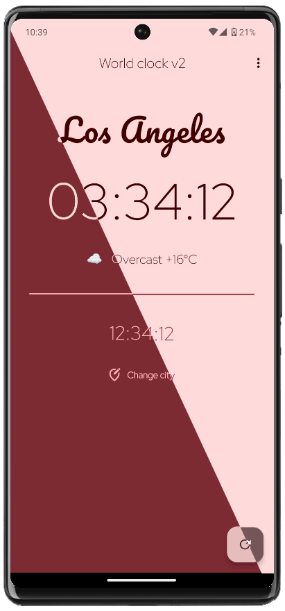

# World Clock v2

World Clock is a Flutter app that displays the current time and weather for various cities. The app uses the Material You theme to provide a modern and customizable user experience.

## Features

- Displays the current time for selected cities.
- Shows the current weather (temperature, weather conditions) for selected cities.
- Customizable Material You theme.

## Screenshots



<!-- Add screenshots of your app here -->

## Installation

Head to the releases for installation candidates.

To install and run the app locally, follow these steps:

1. **Install Flutter**:
   Ensure that Flutter is installed on your system. Follow the [official guide](https://flutter.dev/docs/get-started/install) to install Flutter.

2. **Clone the repository**:
   ```bash
   git clone https://github.com/EricZeller/flutter-world-clock-v2.git
   cd flutter-world-clock-v2
