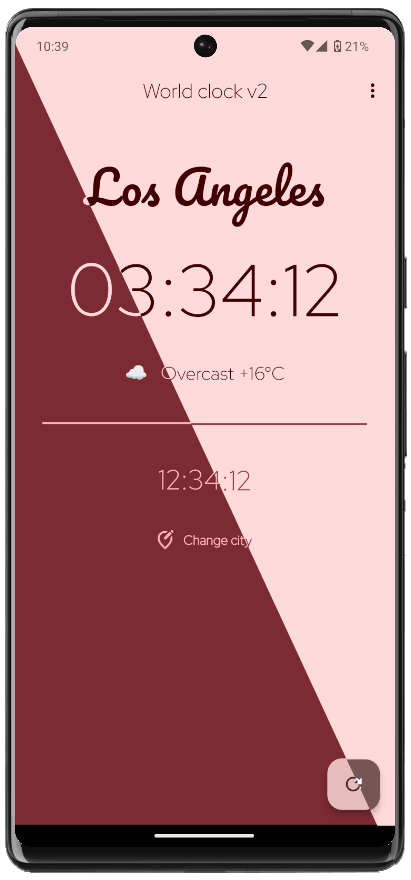
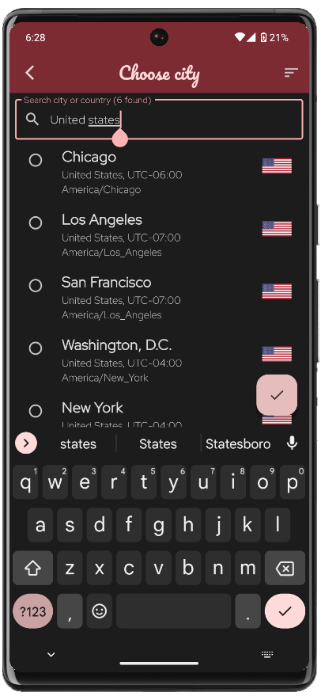
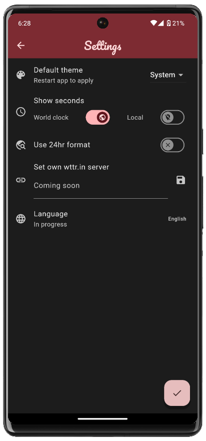
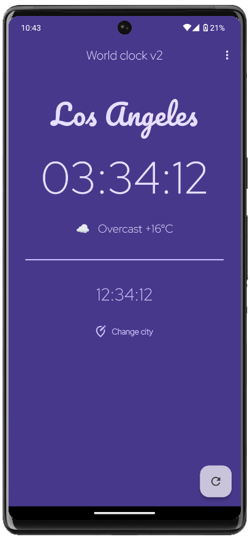

# Material World Clock v2


<a href="https://apt.izzysoft.de/fdroid/index/apk/de.ericz.worldclockv2/"></a>

World Clock is a Flutter app that displays the current time and weather for various cities. The app uses the Material You theme to provide a modern and customizable user experience.

## Features

- Displays the current time for selected cities.
- Shows the current weather (temperature, weather conditions) for selected cities.
- Customizable Material You theme.

## Screenshots

<p align="center">




</p>

## Sources

All icons and fonts from [fonts.google.com](https://fonts.google.com)

Flag icons from [flagpedia.net](https://flagpedia.net/download)

Libraries/packages from pub.dev

Used (keyless) weather API: [wttr.in](https://github.com/chubin/wttr.in) by [@chubin](https://github.com/chubin)


## Installation

Head to the releases for installation candidates.

To install and run the app locally, follow these steps:

1. **Install Flutter**:
   Ensure that Flutter is installed on your system. Follow the [official guide](https://flutter.dev/docs/get-started/install) to install Flutter.

2. **Clone the repository**:
   ```bash
   git clone https://github.com/EricZeller/flutter-world-clock-v2.git
   cd flutter-world-clock-v2
   flutter pub get
   flutter run
